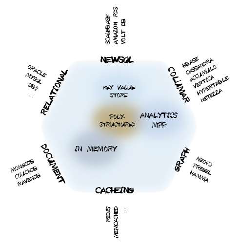
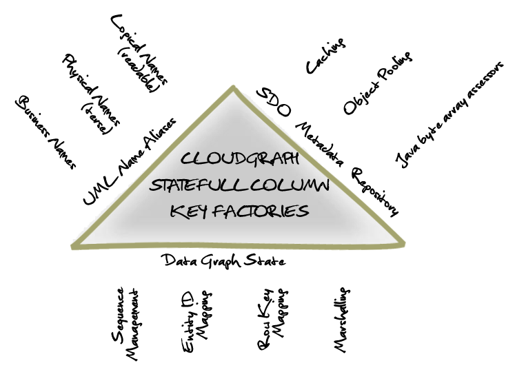
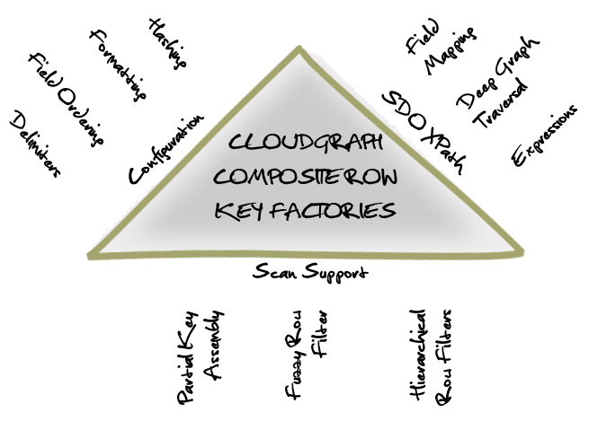
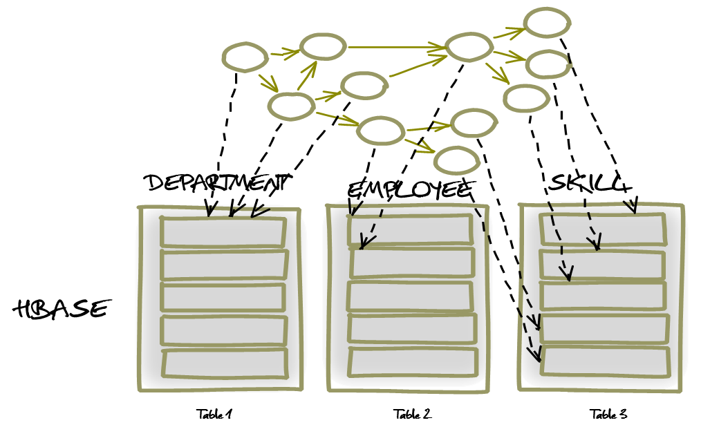
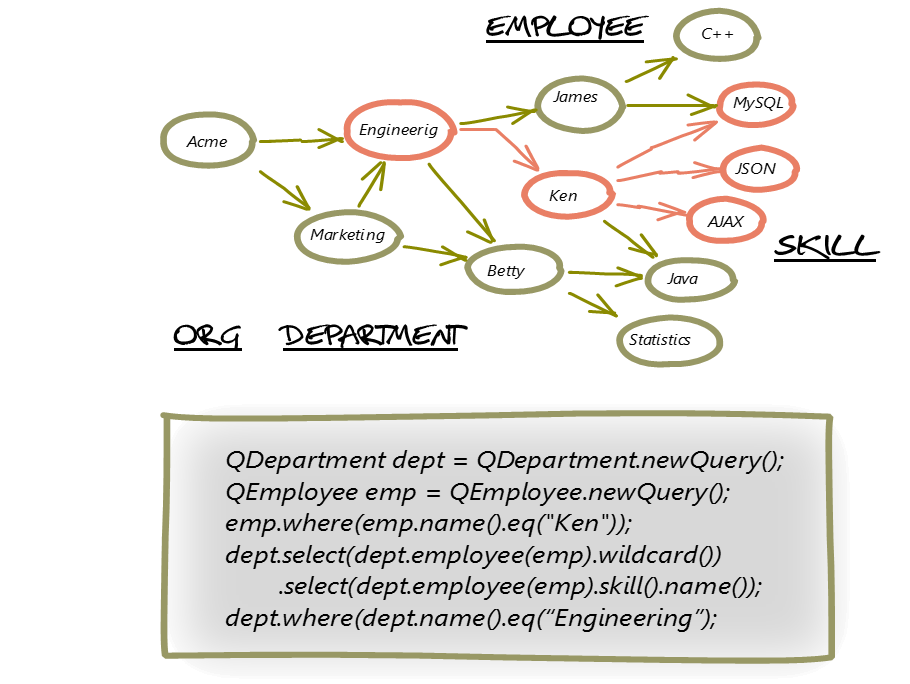
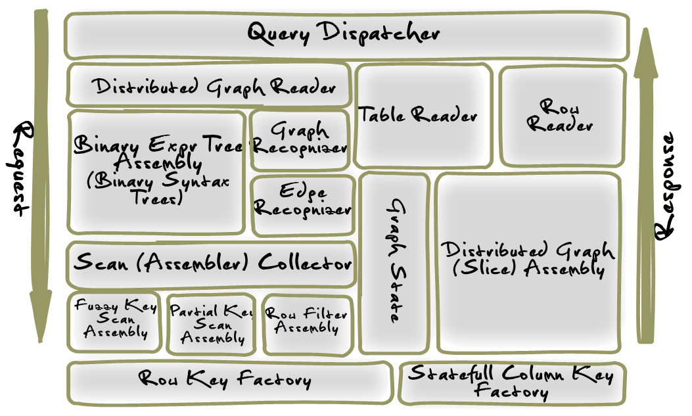

CloudGraph Design Team
TerraMeta Software, Inc.

Architecture Overview

**Revision History**

|              |                  |                                     |                        |
|--------------|------------------|-------------------------------------|------------------------|
| **Revision** | **Date**         | **Description**                     | **Author**             |
| 1.0          | January 12, 2012 | CloudGraph architecture description | CloudGraph Design Team |

<table>
<tbody>
<tr class="odd">
<td> 
 
 
 
Table of Contents</td>
</tr>
<tr class="even">
<td>
<a href="#_Toc479426900">Architecture Overview i</a>

<a href="#introduction">1 Introduction 4</a>

<a href="#overview"><strong>1.1</strong> <strong>Overview</strong> 4</a>

<a href="#mission"><strong>1.2</strong> <strong>Mission</strong> 5</a>

<a href="#design">2 Design 5</a>

<a href="#automated-column-mapping"><strong>2.1</strong> <strong>Automated Column Mapping</strong> 5</a>

<a href="#metadata-name-aliases">2.1.1 Metadata Name Aliases 5</a>

<a href="#cached-metadata-bytes">2.1.2 Cached Metadata &quot;Bytes&quot; 5</a>

<a href="#statefull-column-qualifier-fields">2.1.3 Statefull Column Qualifier Fields 5</a>

<a href="#configurable-composite-row-keys"><strong>2.2</strong> <strong>Configurable Composite Row Keys</strong> 6</a>

<a href="#row-key-configuration">2.2.1 Row Key Configuration 6</a>

<a href="#xpath-support">2.2.2 XPath Support 6</a>

<a href="#scan-optimization-support">2.2.3 Scan Optimization Support 6</a>

<a href="#distributed-graph-mapping"><strong>2.3</strong> <strong>Distributed Graph Mapping</strong> 7</a>

<a href="#distributed-graph-queries"><strong>2.4</strong> <strong>Distributed Graph Queries</strong> 8</a>

<a href="#distributed-graph-creation">2.4.1 Distributed Graph Creation 8</a>

<a href="#distributed-graph-assembly">2.4.2 Distributed Graph Assembly 8</a>

<a href="#distributed-graph-modification">2.4.3 Distributed Graph Modification 8</a>

<a href="#distributed-graph-delete">2.4.4 Distributed Graph Delete 8</a>

<a href="#domain-specific-language-dsl"><strong>2.5</strong> <strong>Domain Specific Language (DSL)</strong> 9</a>

<a href="#graph-slice-queries"><strong>2.6</strong> <strong>Graph &quot;Slice&quot; Queries</strong> 9</a>

<a href="#row-scan-optimization"><strong>2.7</strong> <strong>Row Scan Optimization</strong> 9</a>

<a href="#cloudgraph-hbase">3 CloudGraph HBase 10</a>

<a href="#query-dispatcher"><strong>3.1</strong> <strong>Query Dispatcher</strong> 10</a>

<a href="#distributed-graph-reader">3.1.1 <strong>Distributed Graph Reader</strong> 10</a>

<a href="#table-reader">3.1.2 <strong>Table Reader</strong> 11</a>

<a href="#row-reader">3.1.3 <strong>Row Reader</strong> 11</a>

<a href="#binary-expression-tree-assembler">3.1.4 <strong>Binary Expression Tree Assembler</strong> 11</a>

<a href="#graph-recognizer">3.1.5 <strong>Graph Recognizer</strong> 11</a>

<a href="#edge-recognizer">3.1.6 <strong>Edge Recognizer</strong> 11</a>

<a href="#scan-assembler-collector"><strong>3.1.7</strong> <strong>Scan Assembler Collector</strong> 11</a>

<a href="#fuzzy-key-scan-assembler">3.1.8 <strong>Fuzzy Key Scan Assembler</strong> 11</a>

<a href="#partial-key-scan-assembler">3.1.9 <strong>Partial Key Scan Assembler</strong> 11</a>

<a href="#row-filter-assembler">3.1.10 <strong>Row Filter Assembler</strong> 11</a>

<a href="#row-key-factory">3.1.11 <strong>Row Key Factory</strong> 11</a>

<a href="#statefull-column-key-factory">3.1.12 <strong>Statefull Column Key Factory</strong> 11</a>

<a href="#graph-state-manager">3.1.13 <strong>Graph State Manager</strong> 12</a>

<a href="#distributed-graph-assembler">3.1.14 <strong>Distributed Graph Assembler</strong> 12</a>
</td>
</tr>
</tbody>
</table>

|                                        |
|----------------------------------------|
| Table of Figures                       |
| **No table of figures entries found.** |

**Introduction**
================

**Overview**
------------

CloudGraph® is a suite of Java™ data-graph wide-row mapping and ad hoc query services for big-table sparse, columnar "cloud" and other databases. It provides services and infrastructure to impose the structure of your business domain model, regardless of its size or complexity, as a data-graph oriented service layer over Apache HBase, relational database (RDB) and a growing list of others, providing data store vendor independence and a number of other important features.

Despite often vast differences between data store physical structure, the rich metadata and configuration layers underlying CloudGraph support the integration of a wide range of vendor data stores while not sacrificing any important characteristics of the underlying product. Under HBase for instance, a Table is a large grained object which may have billions of rows and millions of columns. And rather than requiring every entity in your data model to be represented as a separate HBase table, model entities may be grouped in several ways and entity data graphs may be persisted within one row or across any number of rows and tables, then subsequently queried or "sliced" ad hoc using XPath or a generated Domain Specific Language (DSL) based on your domain model. For data stores with accessible metadata or schema, CloudGraph services leverage this underlying schema, but for schema-less data stores, the metadata layer bridges any gaps necessary to implement the query and data graph service API.

Figure 1 - Cloud Datastore Categorization

**Queries and Query Languages**. The CloudGraph service API and services are not bound to one specific query language, but to a flexible and granular abstract query model and associated federated query infrastructure, PlasmaQuery® which supports multiple source query and domain specific languages. This level of abstraction provides several query language options for data stores without a query language as well as the capability to define queries which span or federate multiple heterogeneous data stores.

**Results Data**. Results under the CloudGraph service API are mapped to business domain model specific, directed acyclic graph structures called data graphs. Data graphs provide rich domain context, change capture and 100% compile time checking against all model entities, relationships and data fields.

**Mission**
-----------

Relational database design practices have long taught us to subdivide our business domains into meaningful entities and to add attributes that describe each entity within the business context. The need for meaningful business entities exists regardless of the capabilities or structure of a particular data store.

Imagine taking an average sized relational database composed of 30-40 tables and 200-300 columns and compressing this into a single tabular structure such as a spreadsheet. This is the type of challenge we face as we leverage the new sparse, columnar, distributed or “cloud” databases such as Apache HBase.

\[TBD\]

**Design**
==========

**Automated Column Mapping**
----------------------------

Graphs or data-graphs are both ubiquitous and potentially complex structures often involving numerous 1-to-many and many-to-many associations each link represented as an edge or arc between 2 adjacent graph nodes. Mapping a complex data-graph to the flat set of column qualifier/value pairs that make up a columnar data store row is a challenging task, and developers have identified and addressed this complexity in numerous ways on a per-application basis. CloudGraph moves the task of column mapping into re-usable infrastructure automating the creation of composite column qualifiers and structuring them for fast access based on available client API filters for a particular data store vendor.

### Metadata Name Aliases

Composite column keys are additionally structured for minimal size using a logical to physical name or "alias" mapping for the metadata fields which make up the qualifier. Since the readable (logical) names can vary independently from the (terse) physical names using the underlying SDO implementation, extremely terse physical names can be used while model readability remains unaffected. Limiting the size of column qualifiers in non-relational data stores is important as it can dramatically effect overall data size. See Apache HBase Reference Guide section 34.3 'Try to minimize row and column sizes' and section 34.3.2. 'Attributes'.

### Cached Metadata "Bytes"

Column qualifiers are generated and reconstituted during query processing using on-demand cached physical metadata element names provided by the metadata API within Plasma. The lightweight metadata API within this underlying SDO implementation contains byte-array level, cached look up APIs for all basic metadata elements including logical and physical entity or type names, and logical and physical attribute or property names.

### Statefull Column Qualifier Fields

Generated composite column names for association or reference columns contain a minimal amount or graph "state" or context information, i.e. information that is specific to a particular data graph. These fields are minimal in size even when a data graph is composed of numerous linked local or distributed entities.

The CloudGraph Column Key Factory API involves all of the factors above yet are readable and easy to export and render using standard "spreadsheet" oriented tools.

Figure 2 – Column Key Factories Conceptual Diagram

**Configurable Composite Row Keys**
-----------------------------------

The CloudGraph® composite row key configuration model is a flexible, configurable approach within the very important area of key-value store composite row keys. A selection of pre-defined row key fields are available and users may also define custom fields to access any data property within a data graph. Composite row keys may involve any number of fields in any order, whether pre-defined or user-defined, each adding another queryable "dimension" to the key.

### Row Key Configuration

Composite row keys are defined using an XML configuration segment known as a row key model, and allow for several built in and customizable row key field types. The delimiter and field ordering is flexible, and every field customizable using various formatting, hashing and other options.

### XPath Support

Data graphs are often complex structures and XPath expressions are used to support mapping of a field to any data property within a graph, across any number of associations or entity relations, with all the power and flexibility of XPath. For insert operations, these definitions avoid manual manipulation or traversal of the graph structure to automatically extract properties relevant for a row key.

### Scan Optimization Support

With the rich definitions provided in the row key model, various scan operations can be automated. And for data store vendors with multiple scan API, the optimal API choice can be made and the scan(s) assembled optimally given all available field level detail.

Figure 3 - Composite Row Key Factories Conceptual Diagram

**Distributed Graph Mapping**
-----------------------------

In practice is it often necessary to persist data across multiple columnar data store tables. Consider an Employee entity which may need to belong to multiple Departments and have multiple Skill entities, where skills are shared across all employees. While this model may be most suitable as a distributed mapping, using simple configuration settings it could be mapped in several ways depending on use cases and access patterns. Using CloudGraph configuration mappings, a data graph of any size representing all or part of a data model may:

1.  Occupy a single row in a single table

2.  Span multiple rows in a single table

3.  Span multiple rows across multiple tables

A multi-table distributed graph mapping is easily enabled and changed based on various settings within the configuration, and no special code or model annotations are necessary. Portions or sub-graphs of the distributed graph may be subsequently queried and assembled, as the distributed graph is not bound as a whole.

Figure 4 – Distributed Graph Mapping

**Distributed Graph Queries**
-----------------------------

After a distributed data graph is persisted, the entire graph may of course be selected and returned, typically however it is useful to return a graph subset. Any number of "paths" through a distributed graph may be selected and for each increment or element of a path, and any number of path predicates with relational logic may be used. CloudGraph provides both a free-text API using standard XPath expressions as well as a generated Domain Specific Language (DSL) facilitating 100% compile time checking of all model entities, relationships and data fields.

### Distributed Graph Creation

As a distributed graph is persisted for the first time, data object nodes are ordered based on a detection algorithm which establishes the nature of the relations or associations between their respective types. For example where a source node is related directly or indirectly to a target node through only singular relation(s), for a newly created graph the target node is ordered and therefore created first. And when the target of an association resides in a data sore table external to the current table context, a new row key and context is created. The row state is then mapped and persisted within the graph management or *state* elements within the current row for later de-referencing. See 2.4.2 Data Graph State for more information on graph state.

### Distributed Graph Assembly

As a graph or graph slice is assembled in response to a query, when an external key property is detected as part of the graph selection criteria, the current assembly context is mapped and a new context is determined based on 1.) The target or opposite property and 2.) The CloudGraph™ configuration containing the target entity URI and type name. The target configuration is then used to determine the target cloud data store table, and construct a row key for the new assembly context. Assembly then proceeds within the context of the new row until 1.) Another external key is detected, 2.) The current branch is complete and the next branch is mapped to a different context or 3.) The boundary of the graph is reached.

For configurations supporting distributed graph assembly, the composite row key must contain the predefined UUID row key field.

### Distributed Graph Modification

\[TBD\]

### Distributed Graph Delete

\[TBD\]

**Domain Specific Language (DSL)**
----------------------------------

CloudGraph® provides both a free-text API using standard XPath expressions as well as a generated Domain Specific Language (DSL) facilitating 100% compile time checking of all model entities, relationships and data fields and resulting in code with an almost "fluent" English appearance based on your business domain model.

**Graph "Slice" Queries**
-------------------------

After a data graph is persisted, the entire graph may of course be selected and returned, typically however it is useful to return a graph subset. Any number of paths or "slices" through a graph may be selected and for each segment of a path, any number of path predicates and relational logic may be used. CloudGraph provides both a free-text API using standard XPath expressions, as well as a build-time generated Domain Specific Language (DSL) which is based on your domain model in UML. The query DSL looks as almost "fluent" in appearance and is comprehensive, leveraging model entities, enumerations, relationships, cardinalities, data types, and data properties within your domain model, facilitating 100% compile time checking within your source code.

Figure 5 - Graph Slice Queries Example

**Row Scan Optimization**
-------------------------

A distributed data store table may store millions or billions of rows, so avoiding full table scans is obviously of great importance. CloudGraph leverages all available scan mechanisms for a particular data store but gives priority to the more performant API. With Apache HBase for example, the partial-key-scan facility is extremely fast and therefore given first priority. All graph queries are transformed into a full or partial-key-scan whenever possible based on available field literals found in a query. Short of that, a fuzzy-row-key filter scan is used, and finally if the expressions comprising a query are sufficiently complex, a filter hierarchy is assembled.

**CloudGraph HBase**
====================

Numerous best practices have emerged out of the open-source software ecosystem surrounding HBase. Many best practices target specific strengths of HBase and some accommodate various constraints, such as those related to support for ACID transactions. In HBase atomicity is supported across a single row, not multiple rows or tables. Therefore a common best practice involves grouping potentially large segments of data, for example an entire user profile, within a single HBase row. Other critical best practices involve the use of column families and in particular the use and format and design of composite row and column keys. Composite row key design in particular involves critical decisions affecting the current and future query capabilities of a table and in general the performance and even distribution of table data across regions in a cluster. The CloudGraph HBase Service encapsulates many such best practices in each of these areas and provides a framework within which to encapsulate future best practices as they evolve. Complexities of terse and efficient physical row and column key generation are completely hidden and the client user is provided with rich configuration capability and a generated, standards-based API based on one or more domain-specific business models.

Figure 6 – Query Dispatcher Context Diagram

The CloudGraph HBase service is composed of two major logical components. These are the Graph Dispatcher, which processes all commit operations and the Query Dispatcher, a query engine which takes an abstract object model making up a query, and returns results in the form of one or more arbitrary data graphs. The above diagram illustrates the logical components in context, making up the query processing within the CloudGraph HBase service.

**Query Dispatcher**
--------------------

Manages the syntax tree assembly, creation of a distributed graph reader as well as other related components.

### **Distributed Graph Reader**

Encapsulates one or more graph table reader components for federation across multiple physical tables and/or physical table rows. Maps physical configured table names to respective table readers. In most usage scenarios, a "root" table reader is typically added initially, then other reader are incrementally added as association target types are detected and found configured as graph roots within another distinct table context.

### **Table Reader**

Encapsulates operational, configuration and other state information required for read operations on a single graph table. Acts as a container for one or more RowReader elements and encapsulates the HBase client Get operations for use in read operations across one or more graph rows.

### **Row Reader** 

Provides access to the operational, configuration and other state information required for read operations on a single graph row

### **Binary Expression Tree Assembler** 

Based on the given query model, constructs an operator precedence map, then visits (traverses) the given predicate expression syntax tree depth-first using an adapted shunting-yard algorithm and assembles a resulting binary tree structure. In typical usage scenarios, a single expression tree is assembled once, and then used to evaluate any number of graph edge or other results based on a given context.

### **Graph Recognizer** 

Evaluates or "recognizes" a given data graph by a binary expression tree, within the context of the expression syntax. A graph recognizer is required when query expressions are present which reference properties not found in the row key model for a target graph.

### **Edge Recognizer** 

Evaluates a given data graph entity sequence value by a binary expression tree, within the context of the expression syntax and a given HBase KeyValue map. A sequence uniquely identifies a data graph entity within a local or distributed data graph and is mapped internally to provide global uniqueness.

### **Scan Assembler Collector **

Evaluates or "recognizes" one or more partial, fuzzy and other scan constructs within the context of a binary expression syntax tree. Composite row key scans represent only logical binary 'AND' expressions across the key fields. So for relational binary expressions linked within a query syntax tree by one or more logical binary 'AND', expressions, a single partial or fuzzy row key scan may be used. But for relational binary expressions linked by logical binary 'OR' expressions multiple scans must be used. Clients of this context class may execute the resulting scans in series or in parallel depending on various performance and other considerations.

### **Fuzzy Key Scan Assembler** 

Assembles a composite fuzzy row key bytes / fuzzy info bytes pair where each field within the composite row keys are constructed based a set of query predicates

### **Partial Key Scan Assembler** 

Assembles a composite partial row (start/stop) key pair where each field within the composite start and stop row keys are constructed based a set of query predicates

### **Row Filter Assembler** 

Supports assembly of complex HBase filter hierarchies representing query predicate expression trees using a filter stack.

### **Row Key Factory** 

Generates HBase row keys based on the configured Row Key Model for a specific HTable Configuration.

### **Statefull Column Key Factory** 

Generates HBase column keys based on the configured Column Key Model for a specific HTable Configuration

### **Graph State Manager** 

Provides access to the configuration and state related context information for a specific table row including the management state for the underlying data graph and the composite column key factory used to generated column keys specific to a configured graph

### **Distributed Graph Assembler** 

Supports the assembly of a directed data graph or graph "slice" which may span multiple HBase tables. Graphs may be assembled in series or in parallel.
