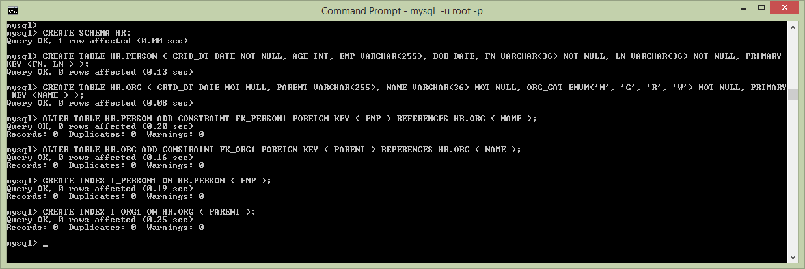

<sup></sup>**CloudGraph**
=============================================================  
TerraMeta Software, Inc.

**CloudGraph Quick Start MySql (POJO)**
===================================
Cloudgraph<sup>®</sup>, PlasmaSDO<sup>®</sup> and PlasmaQuery<sup>®</sup> are registered of Trademarks of TerraMeta Software, Inc.

**Introduction**
================

This step-by-step guide uses only annotated Java (POJO) objects as the source of
schema or metadata. It shows how to build a Maven project which generates a
simple MySql data model with 2 tables which inserts, queries and prints test
data from MySql. It requires basic knowledge of the Java programming language,
Apache Maven, MySql Server administration and assumes the following software
install prerequisites.

-   Java JDK 1.7 or Above
-   Maven 3.x or Above
-   MySql Server 5.5 or Above

See <https://github.com/plasma-framework/plasma-examples-quickstart> for working
examples which accompany this guide.

**CloudGraph Quick Start MySql (POJO)**
===================================

**Add CloudGraph Dependencies**
--------------------------------------

Add the following dependency to your Maven project to get started.

```xml
<dependency>
  <groupId>org.terrameta</groupId>
  <artifactId>plasma-core</artifactId>
  <version>2.0.0</version>
</dependency>
```

Create Entity POJOs 
------------------------

Next create a classic “Person-Org” data model using just Java POJO’s. Create 4
Java enumeration classes annotated as below in a Java package called
**examples.quickstart.mysql.pojo***. (Note: Enumerations rather than Java
classes are annotated to facilitate reuse across multiple code generation and
metadata integration contexts. Your metadata is too valuable to relegate to a
single context)*

The annotations capture typical structural metadata elements.

-   Types and Aliases profiding logical / physical name isolation. See
    [Type](http://plasma-framework.github.io/plasma/apidocs/org/plasma/sdo/annotation/Type.html),
    [Alias](http://plasma-framework.github.io/plasma/apidocs/org/plasma/sdo/annotation/Alias.html).
-   Data Types. See
    [DataProperty](http://plasma-framework.github.io/plasma/apidocs/org/plasma/sdo/annotation/DataProperty.html),
    [ReferenceProperty](http://plasma-framework.github.io/plasma/apidocs/org/plasma/sdo/annotation/ReferenceProperty.html).
-   Cardinalities, Nullability and Visibility. See
    [DataProperty](http://plasma-framework.github.io/plasma/apidocs/org/plasma/sdo/annotation/DataProperty.html),
    [ReferenceProperty](http://plasma-framework.github.io/plasma/apidocs/org/plasma/sdo/annotation/ReferenceProperty.html).
-   Constraints. See
    [ValueConstraint](http://plasma-framework.github.io/plasma/apidocs/org/plasma/sdo/annotation/ValueConstraint.html),
    [EnumerationConstraint](http://plasma-framework.github.io/plasma/apidocs/org/plasma/sdo/annotation/EnumerationConstraint.html).
-   Inheritance relationships (multiple inheritance is supported). See
    [Type](http://plasma-framework.github.io/plasma/apidocs/org/plasma/sdo/annotation/Type.html).
-   Associations between entities. See
    [ReferenceProperty](http://plasma-framework.github.io/plasma/apidocs/org/plasma/sdo/annotation/ReferenceProperty.html).
-   Enumerations as Domain Value Lists. See
    [Enumeration](http://plasma-framework.github.io/plasma/apidocs/org/plasma/sdo/annotation/Enumeration.html).

**Enumeration 1 – OrgCat.java**

```java
import org.plasma.sdo.annotation.Alias;
import org.plasma.sdo.annotation.Enumeration;

@Enumeration(name = "OrgCat")
public enum OrgCat {
  @Alias(physicalName = "N")
  nonprofit,
  @Alias(physicalName = "G")
  government,
  @Alias(physicalName = "R")
  retail,
  @Alias(physicalName = "W")
  wholesale
}
```

**Entity 1 – Party.java**

```java
@Type(name = "Party", isAbstract = true)
public enum Party {
  @Alias(physicalName = "CRTD_DT")
  @DataProperty(dataType = DataType.Date, isNullable = false)
  createdDate
}
```

**Entity 2 – Person.java**

```java
@Alias(physicalName = "PERSON")
@Type(superTypes = { Party.class })
public enum Person {
  @Key(type = KeyType.primary)
  @ValueConstraint(maxLength = "36")
  @Alias(physicalName = "FN")
  @DataProperty(dataType = DataType.String, isNullable = false)
  firstName,
  @Key(type = KeyType.primary)
  @ValueConstraint(maxLength = "36")
  @Alias(physicalName = "LN")
  @DataProperty(dataType = DataType.String, isNullable = false)
  lastName,
  @ValueConstraint(totalDigits = "3")
  @Alias(physicalName = "AGE")
  @DataProperty(dataType = DataType.Int)
  age,
  @Alias(physicalName = "DOB")
  @DataProperty(dataType = DataType.Date)
  dateOfBirth,
  @Alias(physicalName = "EMP")
  @ReferenceProperty(targetClass = Organization.class, targetProperty = "employee")
  employer;
}
```

**Entity 3 – Organization.java**

```java
@Alias(physicalName = "ORG")
@Type(superTypes = { Party.class })
public enum Organization {
  @Key(type = KeyType.primary)
  @ValueConstraint(maxLength = "36")
  @Alias(physicalName = "NAME")
  @DataProperty(dataType = DataType.String, isNullable = false)
  name,
  @EnumConstraint(targetEnum = OrgCat.class)
  @Alias(physicalName = "ORG_CAT")
  @DataProperty(dataType = DataType.String, isNullable = false)
  category,
  @Alias(physicalName = "PARENT")
  @ReferenceProperty(isNullable = true, isMany = false, targetClass =
  Orginization.class, targetProperty = "child")
  parent,
  @Alias(physicalName = "CHILD")
  @ReferenceProperty(isNullable = true, isMany = true, targetClass = Organization.class, targetProperty = "parent")
  child,
  @Alias(physicalName = "EMPLOYEE")
  @ReferenceProperty(isNullable = true, isMany = true, targetClass = Person.class, targetProperty = "employer")
  employee;
}
```

**Create Namespace POJO**
-------------------------

In the same package as the above POJOs, create a file called package_info.java
with the below annotates. These annotations associate the entities we created
previously with a common namespace and data access context. For more information
on applying annotations to package_into.java see
<https://www.intertech.com/Blog/whats-package-info-java-for>

```java
@Alias(physicalName = "HR")
@Namespace(uri = "http://plasma-quickstart-pojo/humanresources")
@NamespaceProvisioning(rootPackageName = "quickstart.pojo.model")
@NamespaceService(storeType = DataStoreType.RDBMS,
  providerName = DataAccessProviderName.JDBC,
  properties = {
    "org.plasma.sdo.access.provider.jdbc.ConnectionURL=jdbc:mysql://localhost:3306/hr?autoReconnect=true",
    "org.plasma.sdo.access.provider.jdbc.ConnectionUserName=root",
    "org.plasma.sdo.access.provider.jdbc.ConnectionPassword=yourpassword",
    "org.plasma.sdo.access.provider.jdbc.ConnectionDriverName=com.mysql.jdbc.Driver",
    "org.plasma.sdo.access.provider.jdbc.ConnectionProviderName=examples.quickstart.connect.DBCPConnectionPoolProvider",
    "org.plasma.sdo.access.provider.jdbc.ConnectionPoolMinSize=1",
    "org.plasma.sdo.access.provider.jdbc.ConnectionPoolMaxSize=10",
    "org.apache.commons.dbcp.validationQuery=SELECT COUNT(\) FROM person",
    "org.apache.commons.dbcp.testOnBorrow=false",
    "org.apache.commons.dbcp.testOnReturn=false",
    "org.apache.commons.dbcp.maxWait=30000",
    "org.apache.commons.dbcp.testWhileIdle=false",
    "org.apache.commons.dbcp.timeBetweenEvictionRunsMillis=30000",
    "org.apache.commons.dbcp.minEvictableIdleTimeMillis=40000"
})
package examples.quickstart.pojo;
import org.plasma.runtime.annotation.NamespaceService;
import org.plasma.runtime.annotation.NamespaceProvisioning;
import org.plasma.sdo.annotation.Namespace;
import org.plasma.sdo.annotation.Alias;
import org.plasma.runtime.DataAccessProviderName;
import org.plasma.runtime.DataStoreType;
```

Namespace 1 – package_info.java

**Add CloudGraph Maven Plugin**
---------------------------

Add the Plasma Maven Plugin with 3 executions which generate data access and
query (DSL) classes as well as a schema for MySql. See below CloudGraph Maven Plugin
Configuration for complete listing.

See <https://github.com/plasma-framework/plasma-examples-quickstart> for working
examples which accompany this guide.

**Generate Source and DDL**
---------------------------

After adding the plugin and 3 executions type:

maven generate-sources

The generated data access source code should appear under
target/generated-sources/quickstart.pojo.model which is the package we specified
in @NamespaceProvisioning on the namespace. Look in
target/ddl/mysql-create.sql. Notice the OrgCat enumeration was used to generate
a MySql check constraint in the HR.ORG table. CloudGraph supports full round-trip
engineering of enumerations across all metadata contexts.

```
CREATE SCHEMA HR;
CREATE TABLE HR.PERSON ( CRTD_DT DATE NOT NULL, AGE INT, EMP VARCHAR(255), DOB DATE, FN VARCHAR(36) NOT NULL, LN VARCHAR(36) NOT NULL, PRIMARY KEY (FN, LN ) );
CREATE TABLE HR.ORG ( CRTD_DT DATE NOT NULL, PARENT VARCHAR(255), NAME VARCHAR(36) NOT NULL, ORG_CAT ENUM('N', 'G', 'R', 'W') NOT NULL, PRIMARY KEY(NAME ) );
ALTER TABLE HR.PERSON ADD CONSTRAINT FK_PERSON1 FOREIGN KEY ( EMP ) REFERENCES HR.ORG ( NAME );
ALTER TABLE HR.ORG ADD CONSTRAINT FK_ORG1 FOREIGN KEY ( PARENT ) REFERENCES HR.ORG ( NAME );
CREATE INDEX I_PERSON1 ON HR.PERSON ( EMP );
CREATE INDEX I_ORG1 ON HR.ORG ( PARENT );
```

Figure 1 – Generated DDL

Now before we can insert or query data, we need to populate MySql with a schema.
Using the above schema, or the one generated at target/ddl/mysql-create.sql
paste or load the schema into MySql.

Figure 2 – Populate MySql with Schema



**Add Run Time Dependencies**
-----------------------------

Next, add the following additional dependencies to your Maven project, including
an RDBMS data access service provider (CloudGraph RDB), the MySql client and a
connection pooling library, DBCP.

```xml
<dependency>
    <groupId>org.cloudgraph</groupId>
    <artifactId>cloudgraph-rdb</artifactId>
    <version>1.0.7</version>
</dependency>
<dependency>
    <groupId>mysql</groupId>
    <artifactId>mysql-connector-java</artifactId>
    <version>5.1.23</version>
</dependency>
<dependency>
    <groupId>commons-dbcp</groupId>
    <artifactId>commons-dbcp</artifactId>
    <version>1.4</version>
</dependency>
```

**Insert and Query MySql Data**
-------------------------------

And finally create a class as below which inserts 2 organizations (parent and
child) with a single employee under the child. The example then queries for the
“graph” traversing the foreign key refrences from the person (as a root) back to
the employer organization and then the parent organization. Then final y the
example prints the serialized result graph as formatted XML for easy
visualization and debugging. The final output should look like the below XML
example. See <https://github.com/plasma-framework/plasma-examples-quickstart>
for working examples which accompany this guide.

**Figure 3 – Result Graph, Serialized as XML**

```xml
<ns1:Person xmlns:ns1="http://plasma-quickstart-pojo/humanresources"xmlns:xs="http://www.w3.org/2001/XMLSchema"
    firstName="Mark" lastName="Hamburg (097161)" age="55" createdDate="2017-10-06T07:00:00">
    <employer name="Best Buy Sales (097161)">
        <parent name="Best Buy Corporation Inc. (097161)" category="R"></parent>
    </employer>
</ns1:Person>
```

**Figure 4 – Inser/Query MySql Data**

```java
package examples.quickstart;

import java.io.IOException;
import java.util.Date;
import org.plasma.runtime.*;
import org.plasma.sdo.*;
import org.plasma.sdo.access.client.*;
import org.plasma.sdo.helper.*;
import quickstart.pojo.model.*;
import quickstart.pojo.model.query.QPerson;
import commonj.sdo.*;

public class ExampleRunner {

  public static CloudGraphDataGraph runExample() throws IOException {
    SDODataAccessClient client = new SDODataAccessClient(new PojoDataAccessClient(
        DataAccessProviderName.JDBC));

    DataGraph dataGraph = CloudGraphDataFactory.INSTANCE.createDataGraph();
    dataGraph.getChangeSummary().beginLogging();
    Type rootType = CloudGraphTypeHelper.INSTANCE.getType(Organization.class);
    String randomSuffix = String.valueOf(System.nanoTime()).substring(10);

    Organization org = (Organization) dataGraph.createRootObject(rootType);
    org.setName("Best Buy Corporation Inc. (" + randomSuffix + ")");
    org.setCategory(OrgCat.RETAIL.getInstanceName());
    org.setCreatedDate(new Date());

    Organization child = org.createChild();
    child.setName("Best Buy Sales (" + randomSuffix + ")");
    child.setCategory(OrgCat.RETAIL.getInstanceName());
    child.setCreatedDate(new Date());

    Person pers = child.createEmployee();
    pers.setFirstName("Mark");
    pers.setLastName("Hamburg (" + randomSuffix + ")");
    pers.setAge(55);
    pers.setCreatedDate(new Date());

    client.commit(dataGraph, ExampleRunner.class.getSimpleName());

    QPerson query = QPerson.newQuery();
    query.select(query.wildcard()).select(query.employer().name())
        .select(query.employer().parent().name()).select(query.employer().parent().category());
    query.where(query.firstName().eq("Mark").and(query.lastName().like("Ham*")));

    DataGraph[] results = client.find(query);
    return (CloudGraphDataGraph) results[0];
  }

  public static void main(String[] args) {
    try {
      CloudGraphDataGraph graph = runExample();
      System.out.println(graph.asXml());
    } catch (IOException e) {
      e.printStackTrace();
    }
  }
}

```

See <https://github.com/plasma-framework/plasma-examples-quickstart> for working
examples which accompany this guide.

Plasma Maven Plugin Configuration
=================================

Below is the Maven plugin listing referenced about which is needed for
generation of data access source code and DDL. See
<https://github.com/plasma-framework/plasma-examples-quickstart> for working
examples which accompany this guide.

```xml
<plugin>
  <groupId>org.terrameta</groupId>
  <artifactId>plasma-maven-plugin</artifactId>
  <version>${plasma.version}</version>
  <dependencies>
    <dependency>
      <groupId>org.terrameta</groupId>
      <artifactId>plasma-core</artifactId>
      <version>${plasma.version}</version>
    </dependency>
    <dependency>
      <groupId>org.cloudgraph</groupId>
      <artifactId>cloudgraph-rdb</artifactId>
      <version>${cloudgraph.version}</version>
    </dependency>
  </dependencies>
  <executions>                                   
    <execution>
      <id>sdo-create</id>
      <configuration>
        <action>create</action>
        <dialect>java</dialect>
        <additionalClasspathElements>
          <param>${basedir}/target/classes</param>
        </additionalClasspathElements>
        <outputDirectory>${basedir}/target/generated-sources/java</outputDirectory>
      </configuration>
      <goals>
        <goal>sdo</goal>
      </goals>
    </execution>
    <execution>
      <id>dsl-create</id>
      <configuration>
        <action>create</action>
        <dialect>java</dialect>
        <additionalClasspathElements>
          <param>${basedir}/target/classes</param>
        </additionalClasspathElements>
        <outputDirectory>${basedir}/target/generated-sources/java</outputDirectory>
      </configuration>
      <goals>
        <goal>dsl</goal>
      </goals>
    </execution>                                         
    <execution>
      <id>ddl-create-mysql</id>
      <configuration>
        <action>create</action>
        <dialect>mysql</dialect>
        <additionalClasspathElements>
          <param>${basedir}/target/classes</param>
        </additionalClasspathElements>
        <outputDirectory>${basedir}/target/ddl</outputDirectory>
        <outputFile>mysql-create.sql</outputFile>
      </configuration>
      <goals>
        <goal>rdb</goal>
      </goals>
    </execution>
  </executions>
</plugin>
```

Maven Compiler Plugin Configuration
===================================

We use 2 executions in the compiler plugin because the annotation discovery for
your annotated Java requires COMPILED classes. The compiled annotated classes
are first used at generate-sources phase, then for several later Maven phases.
An alternative to this "trick" is to isolated your annotated classes in a
separate compiled Maven module, then perform the code generation in a second
module which depends on the first.

```xml
<plugin>
  <groupId>org.apache.maven.plugins</groupId>
  <artifactId>maven-compiler-plugin</artifactId>
  <version>2.3.2</version>
  <configuration>
     <source>1.7</source>
     <target>1.7</target>
     <encoding>UTF-8</encoding>
  </configuration>
  <executions>
    <execution>
      <id>default-compile</id>
      <phase>generate-sources</phase>
      <configuration>
        <excludes>
          <exclude>**/generated-sources/*</exclude>
          <exclude>**/examples/quickstart/*</exclude>
        </excludes>
      </configuration>
    </execution>
    <execution>
      <id>compile-generated</id>
      <phase>compile</phase>
      <goals>
         <goal>compile</goal>
      </goals>
      <configuration>
      </configuration>
    </execution>
  </executions>
</plugin>
```

.