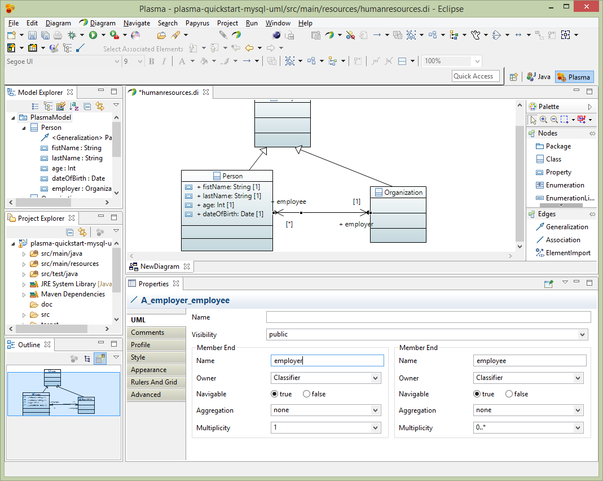

<sup></sup>**CloudGraph**
=============================================================  
TerraMeta Software, Inc.

**CloudGraph Quick Start MySql (UML)**
===================================
Cloudgraph<sup>®</sup>, PlasmaSDO<sup>®</sup> and PlasmaQuery<sup>®</sup> are registered of Trademarks of TerraMeta Software, Inc.

**Introduction**
================

This step-by-step guide uses Unified Modelling Language (UML) as the only source
of schema or metadata. It relies on [CloudGraph Data
Studio](https://github.com/plasma-framework/plasma-data-studio) for creating and
editing UML models and shows how to add plugins and dependencies to an existing
Maven project which generates a simple MySql data model with 2 tables which
inserts, queries and prints test data from MySql. It requires basic knowledge of
the Java programing language, Apache Maven, MySql Server administration and
assumes the following software install prerequisites.

-   Java JDK 1.7 or Above
-   Maven 3.x or Above
-   MySql Server 5.5 or Above
-   Plasma Data Studio

See <https://github.com/plasma-framework/plasma-examples-quickstart> for working
examples which accomplany this guide.

**CloudGraph Quick Start MySql (UML)**
==================================

**Add CloudGraph Dependencies**
---------------------------

Add the following dependency to your existing Maven project to get started.

```xml
<dependency>
  <groupId>org.terrameta</groupId>
  <artifactId>plasma-core</artifactId>
  <version>2.0.0</version>
</dependency>
```

**Create a New UML Model**
--------------------------

From Plasma Data Studio (see prerequisites) create a new UML model and diagram
into the src/main/resources directory of your existing maven project.

1.  Right click on the resources directory, then to New-\>Other-\>CloudGraph as
    below.

2.  Save the model (it will have a .di extension, for diagram) in the resources
    dir of the project.

3.  Select CloudGraph Class Diagram for the diagram type. Then Finish the wizard.


**Edit the UML Model**
----------------------

From Plasma Data Studio (see prerequisites) open the CloudGraph Perspective.


The new mode can be edited and annotated as any Papyrus model. See
<https://www.eclipse.org/papyrus/> for detailed documentation on Eclipse
Papyrus. Plasma Data Studio however has a custom pallete which restricts the
available UML elements to those applicable to CloudGraph structural models. Double
click or drag 2 class elements to the diagram and name one Person and one
Organization.


Next add a class called Party and make it anstract, then use generalization
edges to make the Person and Organization classes inherit from Party.


Next add properties to the Person entity. Before adding properties we need to
import datatypes to use for the property datatypes. Select the root element of
the project in the Model Explorer, then select Import-\>Import Registered
Package. Then select CloudGraph Data Types and load the package into your model.


Next using the plus (+) sign in the properties editor, add 4 properties
firstName, lastName, age and dateOfBirth with datatypes (String, String, Int,
Date) respectively. Note that the Papyres Filters must be used to make the
properties appear in the entity. Right click on the entity and select
Filters-\>Show/Hide Contents.


Next we will link the Person and Organization entities with an association.
Select Association from the edges palette and link the Person and Organization
entities. Make both ends of the association navigable and owned by the
respective Classifier and make the Multiplicity on the Organization side
zero-to-many as below. And instead of leaving the default names for the
association ends (person, organization) make these more specific to a Human
Resources model such as employer and employee, as below.



Next add 2 properties to the Organization entity name and category, both with
String datatypes from the CloudGraph Data Types package. We will enhance the
category property with an enumeration restriction later. Then add a recursive
association to the Organization entity as below, with both sides of the
association owned by the classifier. Note that the Papyres Filters must be used
to make the properties appear in the entity. Right click on the entity and
select Filters-\>Show/Hide Contents.


Nexte add a property to the shared entity we created previously called Party.
Just add 1 property createdDate of data type Date. This property will be
inherited by both the Person and Organization entities.


**Enhance the UML Model**
-------------------------

After creating a basic model we need to add enhancements using standard UML
Profile mechanisms supported by Eclipse Papyrus, which add “facets” to various
elements. These facets describe restrictions such as String property length
restrictions enumeration restrictions and several others which provide a
complete structural model description. The final model has enough information to
allow us to generate code and persist the entities we created in one or more
physical data stores. (*Note that for big-data stores such as HBase the size of
the physical table is greatly influenced by the size of column names, and the
logical/physical name isolation provided by CloudGraph is critical for controlling
the size of the physical store while maintaining a readable data model and
generated code*) First select the root package node on the Model Explorer and
rename the package to HumanResources. Then select the Profile editor section and
add the SDOAlias and SDONamespace stereotypes. Assign the SDOAlias physicalName
= ‘’HR’ for the model package and the SDONamespace uri =
‘http://plasma-quickstart-pojo/humanresources’. The URI is critical and is used
to link the model to a specific data store. A large model can of course have
numerous packages and each package can be associated the the same or several
data store providers.


Next select the Person entity and edit the Profile section of the property
editor as below. Add the SDOAlias stereotype and assign the physicalName as
‘PERSON’.


Next assign the Orgaization entity the physicalName of ‘ORG’.


Next for the Person entity firstName property, select the Profile section of the
editor and assign the SDOAlias, SDOKey and SDOValueConstraint stereotypes. Then
assign SDOAlias physicalName = “FN” and SDOKey type=’primary’ and
SDOValueConstraint maxLength=36 as below.


Next similarly for the Person entity lastName property, select the Profile
section of the editor and assign the SDOAlias, SDOKey and SDOValueConstraint
stereotypes. Then assign SDOAlias physicalName = “LN” and SDOKey type=’primary’
and SDOValueConstraint maxLength=36.

Next similarly for the Person entity dateOfBirth property, select the Profile
section of the editor and assign the SDOAlias stereotype. Then assign SDOAlias
physicalName = “DOB”.


Next to enhance the Organization entity, we will first create an Enumeration
‘OrgCat’ which will be used to restrict the values of the category property we
added earlier. Add four owned literals to the OrgCat enumeration ‘nonprofit’,
‘government’, ‘retail’, “wholesale” and assign each literal a physicalName which
is the fitst letter i.e. ‘N’, ‘G’, ‘R’ and ‘W’ respectively as below.


Next edit the Organization category property Profile section adding the
SDOAlias, SDOEnumerationConstraint and SDOValueConstraint stereotypes. Assign
the SDOAlias and SDOValueConstraint stereotypes as below and assign the
SDOEnumerationConstraint to the OrgCat enumeration we created previously.


Next for the Organization entity name property, select the Profile section of
the editor and assign the SDOAlias, SDOKey and SDOValueConstraint stereotypes.
Then assign SDOAlias physicalName = “NAME” and SDOKey type=’primary’ and
SDOValueConstraint maxLength=36 similarly.

And finally for the Party entity createdDate property select the Profile section
of the editor and assign the SDOAlias stereotypes Then assign SDOAlias
physicalName = “CRTD_DT” similarly as below.


**Add CloudGraph Configuration XML**
--------------------------------

In the Maven project src/main/resources directory add a file called
plasma-configuration.xml which links the UML artifact and various
code-generation and other configuration elements, as below.

```xml
<?xml version="1.0" encoding="UTF-8"?>
<cfg:RuntimeConfiguration  
    xmlns:cfg="http://www.plasma.org/runtime">
	<SDO>
		<GlobalProvisioning packageName="org.plasma.platform.sdo">
			<Interface />
			<Implementation classNameSuffix="Impl"
				childPackageName="impl" />
			<QueryDSL>
				<Implementation classNamePrefix="Q" childPackageName="query" />
			</QueryDSL>
		</GlobalProvisioning>

		<Namespace uri="http://plasma-quickstart-pojo/humanresources"
			artifact="http://humanresources.uml">
			<Provisioning packageName="quickstart.pojo.model" />
		</Namespace>

		<DataAccessService dataStoreType="RDBMS">
			<DataAccessProvider name="JDBC"
				className="org.cloudgraph.rdb.service.RDBGraphService">
				<!-- DBCP provider -->
				<Property name="org.plasma.sdo.access.provider.jdbc.ConnectionURL">jdbc:mysql://localhost:3306/hr?autoReconnect=true
				</Property>
				<Property name="org.plasma.sdo.access.provider.jdbc.ConnectionPassword">yourpassword</Property>
				<Property name="org.plasma.sdo.access.provider.jdbc.ConnectionUserName">root</Property>
				<Property name="org.plasma.sdo.access.provider.jdbc.ConnectionDriverName">com.mysql.jdbc.Driver</Property>
				<Property
					name="org.plasma.sdo.access.provider.jdbc.ConnectionProviderName">org.cloudgraph.examples.wordnet.connect.DBCPConnectionPoolProvider
				</Property>
				<Property
					name="org.plasma.sdo.access.provider.jdbc.ConnectionPoolMinSize">0</Property>
				<Property
					name="org.plasma.sdo.access.provider.jdbc.ConnectionPoolMaxSize">40</Property>
				<Property name="org.apache.commons.dbcp.validationQuery">SELECT COUNT(*) FROM PERSON</Property>
				<Property name="org.apache.commons.dbcp.testOnBorrow">false</Property>
				<Property name="org.apache.commons.dbcp.testOnReturn">false</Property>
				<Property name="org.apache.commons.dbcp.maxWait">30000</Property>
				<Property name="org.apache.commons.dbcp.testWhileIdle">false</Property>
				<Property name="org.apache.commons.dbcp.timeBetweenEvictionRunsMillis">30000</Property>
				<Property name="org.apache.commons.dbcp.minEvictableIdleTimeMillis">40000</Property>
				<Concurrency pessimisticLockTimeoutMillis="300000" />
				<NamespaceLink uri="http://plasma-quickstart-pojo/humanresources" />
			</DataAccessProvider>
		</DataAccessService>
	</SDO>
	<Repository>
		<Artifact name="humanresources.uml" urn="humanresources.uml"
			namespaceUri="http://humanresources.uml" />
	</Repository>
</cfg:RuntimeConfiguration>   

```


**Add CloudGraph Maven Plugin**
---------------------------

Add the Plasma Maven Plugin with 3 executions which generate data access and
query (DSL) classes as well as a schema for MySql. See below CloudGraph Maven Plugin
Configuration for complete listing.

See <https://github.com/plasma-framework/plasma-examples-quickstart> for working
examples which accomplany this guide.

**Generate Source and DDL**
---------------------------

After adding the plugin and 3 executions type:

maven generate-sources

The generated data access source code should appear under
target/generated-sources/quickstart.pojo.model which is the package we specified
in \@NamespaceProvisioning on the namespace. Look in
target/ddl/mysql-create.sql. Notice the OrgCat enumeration was used to generate
a MySql check constraint in the HR.ORG table. CloudGraph supports full round-trip
engineering of enumerations across all metadata contexts.

```
CREATE SCHEMA HR;
CREATE TABLE HR.PERSON ( CRTD_DT DATE NOT NULL, AGE INT, EMP VARCHAR(255), DOB DATE, FN VARCHAR(36) NOT NULL, LN VARCHAR(36) NOT NULL, PRIMARY KEY (FN, LN ) );
CREATE TABLE HR.ORG ( CRTD_DT DATE NOT NULL, PARENT VARCHAR(255), NAME VARCHAR(36) NOT NULL, ORG_CAT ENUM('N', 'G', 'R', 'W') NOT NULL, PRIMARY KEY(NAME ) );
ALTER TABLE HR.PERSON ADD CONSTRAINT FK_PERSON1 FOREIGN KEY ( EMP ) REFERENCES HR.ORG ( NAME );
ALTER TABLE HR.ORG ADD CONSTRAINT FK_ORG1 FOREIGN KEY ( PARENT ) REFERENCES HR.ORG ( NAME );
CREATE INDEX I_PERSON1 ON HR.PERSON ( EMP );
CREATE INDEX I_ORG1 ON HR.ORG ( PARENT );
```

Figure 1 – Generated DDL

Now before we can insert or query data, we need to populate MySql with a schema.
Using the above schema, or the one generated at target/ddl/mysql-create.sql
paste or load the schema into MySql.

Figure 2 – Populate MySql with Schema


**Add Run Time Dependencies**
-----------------------------

Next, add the following additional dependencies to your Maven project, including
an RDBMS data access service provider (CloudGraph RDB), the MySql client and a
connection pooling library, DBCP.

```xml
<dependency>
    <groupId>org.cloudgraph</groupId>
    <artifactId>cloudgraph-rdb</artifactId>
    <version>1.0.7</version>
</dependency>
<dependency>
    <groupId>mysql</groupId>
    <artifactId>mysql-connector-java</artifactId>
    <version>5.1.23</version>
</dependency>
<dependency>
    <groupId>commons-dbcp</groupId>
    <artifactId>commons-dbcp</artifactId>
    <version>1.4</version>
</dependency>
```

**Insert and Query MySql Data**
-------------------------------

And finally create a class as below which inserts 2 organizations (parent and
child) with a single employee under the child. The example then queries for the
“graph” traversing the foreign key refrences from the person (as a root) back to
the employer organization and then the parent organization. Then final y the
example prints the serialized result graph as formatted XML for easy
visualization and debugging. The final output should look like the below XML
example. See <https://github.com/plasma-framework/plasma-examples-quickstart>
for working examples which accomplany this guide.

Figure 3 – Result Graph, Serialized as XML

```xml
<ns1:Person xmlns:ns1="http://plasma-quickstart-pojo/humanresources"xmlns:xs="http://www.w3.org/2001/XMLSchema"
    firstName="Mark" lastName="Hamburg (097161)" age="55" createdDate="2017-10-06T07:00:00">
    <employer name="Best Buy Sales (097161)">
        <parent name="Best Buy Corporation Inc. (097161)" category="R"></parent>
    </employer>
</ns1:Person>
```

Figure 4 – Inser/Query MySql Data

```java
package examples.quickstart;

import java.io.IOException;
import java.util.Date;
import org.plasma.runtime.*;
import org.plasma.sdo.*;
import org.plasma.sdo.access.client.*;
import org.plasma.sdo.helper.*;
import quickstart.pojo.model.*;
import quickstart.pojo.model.query.QPerson;
import commonj.sdo.*;

public class ExampleRunner {

  public static CloudGraphDataGraph runExample() throws IOException {
    SDODataAccessClient client = new SDODataAccessClient(new PojoDataAccessClient(
        DataAccessProviderName.JDBC));

    DataGraph dataGraph = CloudGraphDataFactory.INSTANCE.createDataGraph();
    dataGraph.getChangeSummary().beginLogging();
    Type rootType = CloudGraphTypeHelper.INSTANCE.getType(Organization.class);
    String randomSuffix = String.valueOf(System.nanoTime()).substring(10);

    Organization org = (Organization) dataGraph.createRootObject(rootType);
    org.setName("Best Buy Corporation Inc. (" + randomSuffix + ")");
    org.setCategory(OrgCat.RETAIL.getInstanceName());
    org.setCreatedDate(new Date());

    Organization child = org.createChild();
    child.setName("Best Buy Sales (" + randomSuffix + ")");
    child.setCategory(OrgCat.RETAIL.getInstanceName());
    child.setCreatedDate(new Date());

    Person pers = child.createEmployee();
    pers.setFirstName("Mark");
    pers.setLastName("Hamburg (" + randomSuffix + ")");
    pers.setAge(55);
    pers.setCreatedDate(new Date());

    client.commit(dataGraph, ExampleRunner.class.getSimpleName());

    QPerson query = QPerson.newQuery();
    query.select(query.wildcard()).select(query.employer().name())
        .select(query.employer().parent().name()).select(query.employer().parent().category());
    query.where(query.firstName().eq("Mark").and(query.lastName().like("Ham*")));

    DataGraph[] results = client.find(query);
    return (CloudGraphDataGraph) results[0];
  }

  public static void main(String[] args) {
    try {
      CloudGraphDataGraph graph = runExample();
      System.out.println(graph.asXml());
    } catch (IOException e) {
      e.printStackTrace();
    }
  }
}
```

See <https://github.com/plasma-framework/plasma-examples-quickstart> for working
examples which accomplany this guide.

Plasma Maven Plugin Configuration
=================================

Below is the Maven plugin listing referenced about which is needed for
generation of data access source code and DDL. See
<https://github.com/plasma-framework/plasma-examples-quickstart> for working
examples which accomplany this guide.

```xml
<plugin>
  <groupId>org.terrameta</groupId>
  <artifactId>plasma-maven-plugin</artifactId>
  <version>${plasma.version}</version>
  <dependencies>
    <dependency>
      <groupId>org.terrameta</groupId>
      <artifactId>plasma-core</artifactId>
      <version>${plasma.version}</version>
    </dependency>
    <dependency>
      <groupId>org.cloudgraph</groupId>
      <artifactId>cloudgraph-rdb</artifactId>
      <version>${cloudgraph.version}</version>
    </dependency>
  </dependencies>
  <executions>                                   
    <execution>
      <id>sdo-create</id>
      <configuration>
        <action>create</action>
        <dialect>java</dialect>
        <additionalClasspathElements>
          <param>${basedir}/target/classes</param>
        </additionalClasspathElements>
        <outputDirectory>${basedir}/target/generated-sources/java</outputDirectory>
      </configuration>
      <goals>
        <goal>sdo</goal>
      </goals>
    </execution>
    <execution>
      <id>dsl-create</id>
      <configuration>
        <action>create</action>
        <dialect>java</dialect>
        <additionalClasspathElements>
          <param>${basedir}/target/classes</param>
        </additionalClasspathElements>
        <outputDirectory>${basedir}/target/generated-sources/java</outputDirectory>
      </configuration>
      <goals>
        <goal>dsl</goal>
      </goals>
    </execution>                                         
    <execution>
      <id>ddl-create-mysql</id>
      <configuration>
        <action>create</action>
        <dialect>mysql</dialect>
        <additionalClasspathElements>
          <param>${basedir}/target/classes</param>
        </additionalClasspathElements>
        <outputDirectory>${basedir}/target/ddl</outputDirectory>
        <outputFile>mysql-create.sql</outputFile>
      </configuration>
      <goals>
        <goal>rdb</goal>
      </goals>
    </execution>
  </executions>
</plugin>
```

Maven Compiler Plugin Configuration
===================================

We use 2 executions in the compiler plugin because the annotation discovery for
your annotated Java requires COMPILED classes. The compiled annotated classes
are first used at generate-sources phase, then for several later Maven phases.
An alternative to this "trick" is to isolated your annotated classes in a
separate compiled Maven module, then perform the code generation in a second
module which depends on the first.

```xml
<plugin>
  <groupId>org.apache.maven.plugins</groupId>
  <artifactId>maven-compiler-plugin</artifactId>
  <version>2.3.2</version>
  <configuration>
     <source>1.7</source>
     <target>1.7</target>
     <encoding>UTF-8</encoding>
  </configuration>
  <executions>
    <execution>
      <id>default-compile</id>
      <phase>generate-sources</phase>
      <configuration>
        <excludes>
          <exclude>**/generated-sources/*</exclude>
          <exclude>**/examples/quickstart/*</exclude>
        </excludes>
      </configuration>
    </execution>
    <execution>
      <id>compile-generated</id>
      <phase>compile</phase>
      <goals>
         <goal>compile</goal>
      </goals>
      <configuration>
      </configuration>
    </execution>
  </executions>
</plugin>
```
.
